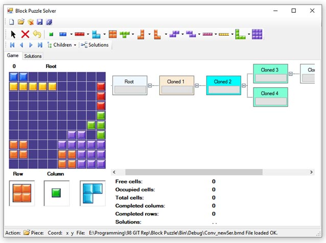
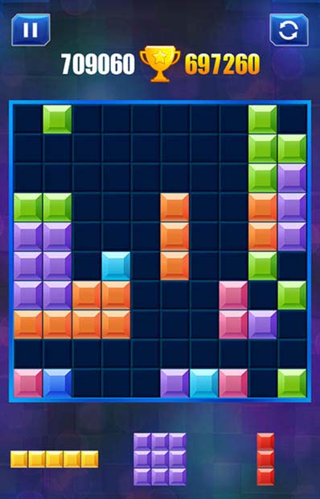
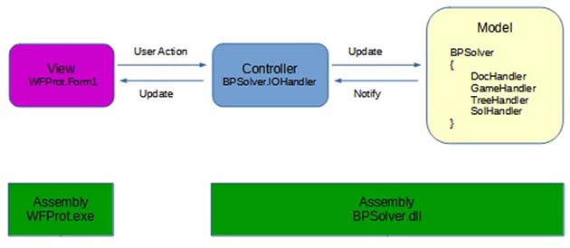
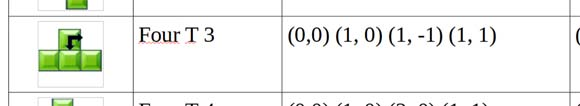
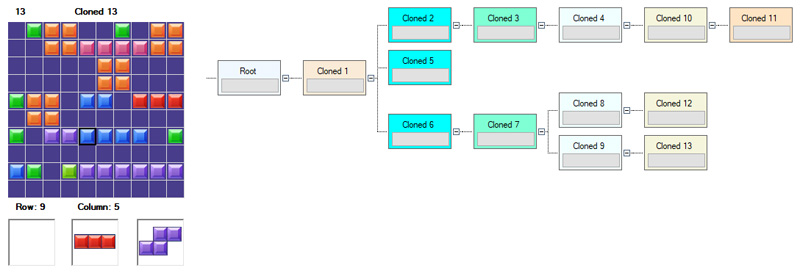
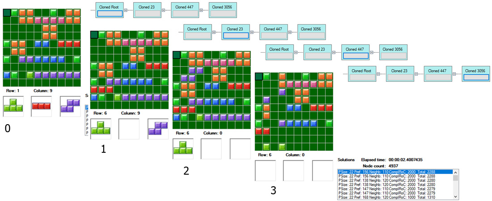

# Block Puzzle Suite
How to trick Block Puzzle and learn something in the process.

This project is a simple yet functional integration of several matters such as game trees, command pattern, state machines and event based components.

**Introduction**
 
Block Puzzle is a popular, very addictive and deceitfully simple puzzle game.



Lots of people use it everyday just for fun or to exercise their brains. It has a 10 by 10 cell matrix, a set of shapes made of one up to nine colored squares and three random shapes to play with. The goal is to complete rows/columns to remove from the board and keep playing (if you are concentrated enough) forever. After losing some month-lenght games, I started wondering how feasible it was to build a program to find possible solutions to specific situations in the game. Following careful thought and doing some research I decided I've found a good reason to spend time integrating things like game trees, state machines, behavioral patterns and event based components, to create such a program. Throughout this article, the guidelines to build a desktop application using C#, Windows Forms and .NET Framework will be presented. It has been a real challenge to find the balance between a trivial explanation and a complex lengthy treatment of the subject, and soon you'll find out if this objective was achieved.

**Design decisions**

It was clear that a GUI was absolutely needed. I've seen and coded a lot of command line prototypes, but to this project, displaying and manipulating of geometric colored shapes was paramount. As a direct consequence, to handle event orchestration complexity the sane way, a state machine will be implemented to control the interface behavior. On the same line of thought, to allow the user recover from mistaken actions, the command pattern with undo will be included. Data trees are used to register the sequence of states in a game and also to explore the possible solutions for a particular state. Given the foreseen increase in developing time caused by the former decisions, the reuse of existing components is neccesary.  

Let's move on to a high, architectural level. Some of Ted Faison and Ralf Westphal's ideas are used to build independent, low coupled, easy to test components. Those components, properly grouped, fit into MVC pattern. 



The GUI -as View- is isolated in its own assembly. Its interactions with the components that Model the game and find solutions are serviced by the Controller, acting as mediator. All components provide functionality defined in its given interface and the signaling/switching mechanism is implemented with delegates and late binding.
Without further ado, let's see the highlights of the code. Just a little reminder first. There is nothing remarkably new here, just a well thought out (I hope) merge of proven methods and ideas. 

Let's start modeling the game from the bottom, in what I like to call LISP style.

**Coord**

In the beginning was the coord.
```csharp
    public struct Coord
    {
        public int Row;
        public int Col;
        ..  
		public Coord(Coord coord)
        {
            Row = coord.Row;
            Col = coord.Col;
        }

        static public Coord operator +(Coord one, Coord two)
        {
            Coord result = new Coord(one);
            result.Row += two.Row;
            result.Col += two.Col;

            return result;
        }
    }
```

This unexciting struct represents locations in a 2D matrix. The overloaded + operator adds two of it. 

**Piece**

The game uses 35 square shapes in nine colors. I chose to name these shapes Pieces, for no particular reason, and that got stuck. A Piece stores some data and a list of relative coordinates of all of its squares. It is used to create two important lists of absolute coordinates. One for the squares forming the shape and another for its neighbors. The former list is used to check if a given Piece can be drawn on the board and to actually draw it. The latter is used in evaluating a solution.
```csharp
    public struct Piece
    {
        public PieceName Name { get; private set; }
        public PieceColor Color { get; private set; }
        public int Count
        {   get  { return Matrix.Count ; }  }
        
        // Relative coords of squares
        public List<Coord> Matrix { get;  private set; }

        ...

        //  Returns a list of absolute locations
        public static List<Coord> GetRealCoords(Piece instance, Coord point)
        {
            Coord newCoord;
            List<Coord> realCoords = new List<Coord>();

            foreach (var coord in instance.Matrix)
            {
                newCoord = point + coord;
                realCoords.Add(newCoord);
            }

            return realCoords;
        }
		...
    }
```
Let's see the specification for a particular Piece:



The list of relative coordinates is passed when the concrete Piece is created:
```csharp
	//
	piece = new Piece(PieceName.FourT3,
			    PieceColor.Eight,
			    new List<Coord>() {
				    new Coord(0, 0), new Coord(1, 0), new Coord(1, -1), new Coord(1, 1) });
	// Storing Piece 
	_pieceSet.Add(piece.Name, piece);
	//
```
The static method **GetRealCoords** combines an absolute 2D location with the list of relative coordinates for a piece, returning a list of absolute locations. If the piece is to be inserted in the board, the list is then used to check all locations are inside the board boundaries and not occupied with other squares.

**Cell**

The Cell class is just a simple storage for location and color, powered with a predicate function and utility constructors. See the code for details.

**Board**

Finally, something useful. One hundred Cells are grouped together in the Board class, it implements IEnumerable<> to facilitate LINQ querying. Individual cells can be accessed via indexers.

```csharp
	[Serializable]
    public class Board : IEnumerable<Cell>
    {
        public List<Cell> Cells { get; private set; }
		...
		public Cell this[int row, int column]
        {   
            get
            {
                return Cells.First(z => z.Row == row && z.Col == column);
            }
        }

        public Cell this[Coord coord]
        {
            get
            {
                return Cells.First(z => z.Row == coord.Row && z.Col == coord.Col);
            }
        }
		...
	}	
```
**GameStatus**

Another storage class. In order to model a particular status of the game we need a Board with Cells on it, what Pieces are ready to play by making a Movement and (when finding solutions) what value the movement gets in its Evaluation.

This class, combined with a data tree, are used in two ways. First, to represent the sequence of the game as it develops in time. The game sequence can be thought as a linear sucession of states. At any point, the user must choose one Piece out of three to make the move. Since we are giving the user the possibility to come back to a previous state and try another variant (by using a different Piece), we are actually creating a tree of states. 


So far, the program acts like an aid to the user to explore solutions. But, what if we want it to give us lazy ones a solution, without racking our brains? 

That is the second way. The solution finder component implements a method to explore all possible combinations of moves from a particular game state, creating a tree of game states. Every state is evaluated and asigned a score value. All leaves in the tree are candidate solutions. Candidate solutions that achieve a row or column completion are scored higher than the ones wich not.

TBC...